# Librerías


```r
library(splitstackshape)
library(ggplot2)
library(magrittr)
library(moments)
library(dplyr)
library(patchwork)
library(car)
library(knitr)
library(bookdown)
```


# Datos

Los datos están relacionados con campañas de marketing directo de una institución financiera. Las campañas de marketing se basaron en llamadas telefónicas. A menudo, se requirió más de un contacto con el mismo cliente para determinar si el producto (un depósito a plazo bancario) sería suscrito `yes` o `no`. Deberás analizar el conjunto de datos para buscar formas de encontrar estrategias futuras y mejorar las campañas de marketing para el banco.

## Información de los atributos

### Variables de entrada

| \#  | Variable  | Tipo | Descripción | Ejemplos |
|-----|-----------|------|-------------|----------|
| 1   | age       | numérico    |      |          |
| 2   | job       | categórico  | tipo de empleo | `admin`, `blue-collar`, `entrepreneur`, `housemaid`, `management`, `retired`, `self-employed`, `services`, `student`, `technician`, `unemployed`, `unknown`|
| 3   | marital   | categórico  | estado civil | `divorced`\*, `married`, `single`, `unknown`|
| 4   | education | categórico |  | `basic.4y`, `basic.6y`, `basic.9y`, `high.school`, `illiterate`, `professional.course`, `university.degree`, `unknown` |
| 5   | default   | categórico  | tiene crédito en mora |  `no`, `yes`, `unknown` |
| 6   | balance   | numérico    | | |
| 7   | housing   | categórico  | tiene préstamo hipotecario?   | `no`, `yes`, `unknown` |
| 8   | loan      | categórico  | tiene préstamo personal?  | `no`, `yes`, `unknown` |

> \* **Nota:** `divorced` significa `divorced` o `widowed`

*Relacionado con el último contacto de la campaña actual*

| \#  | Variable | Tipo | Descripción | Ejemplos |
|-----|-----------|-----|-------------|----------|
| 9   | contact   | categórico  | tipo de comunicación de contacto | `cellular`, `telephone` |
| 10  | month     | categórico  | último mes de contacto en el año | `jan`, `feb`, `mar`, ... , `nov`, `dec` |
| 11  | day       | categórico  | último día de la semana de contacto | `mon`, `tue`, `wed`, `thu`, `fri` |
| 12  | duration  | numérico    | duración del último contacto, en segundos\* | |

> \* **Nota:** Este atributo afecta significativamente el resultado `target` (por ejemplo, si `duration=0` entonces `y=no`). Sin embargo, la duración no se conoce antes de realizar una llamada. Además, después de finalizar la llamada, es obvio si `y` es conocido. Por lo tanto, este atributo solo debería incluirse con fines de referencia y debería descartarse si la intención es tener un modelo predictivo realista.

*Otros atributos*

| \#  | Variable  | Tipo        | Descripción | Ejemplos |
|-----|-----------|-------------|-------------|----------|
| 13  | campaign  | numérico    | número de contactos realizados durante esta campaña para este cliente, incluyendo el último contacto | |
| 14  | pdays     | numérico    | número de días transcurridos desde el último contacto de una campaña anterior con el cliente      | `999` significa que el cliente no fue contactado previamente |
| 15  | previous  | numérico    | número de contactos realizados antes de esta campaña para este cliente | |
| 16  | poutcome  | categórico  | resultado de la campaña de marketing anterior | `failure`, `nonexistent`, `success` |

### Variable de salida

| \#  | Variable | Tipo | Descripción | Ejemplos    |
|-----|----------|---------|---------|-------------|
| 17  | deposit  | binario | ¿el cliente ha suscrito un depósito a plazo fijo? | `yes`, `no` |

# Constantes

Se requiere fijar ciertas constantes, como el nivel de significancia, entre otros.


```r
alpha <- 0.05
```

# Datos

Se cargan los datos.


```r
df <- read.csv("data/data.csv")
```

Se muestran algunas filas de los datos.


```r
head(df)
```

```
##   age         job marital education default balance housing loan  contact day month duration campaign pdays previous poutcome deposit
## 1  38  technician married  tertiary      no     127     yes   no cellular  14   oct      113        1    50        2  success      no
## 2  41   housemaid married   primary      no     365      no   no cellular   8   aug      203        5   999        0  unknown      no
## 3  39  management  single  tertiary      no    2454     yes   no cellular   4   may      716        3   263        2  failure     yes
## 4  49 blue-collar married   primary      no    6215     yes   no cellular  11   may      549        1   999        0  unknown      no
## 5  37    services married secondary      no    1694     yes  yes cellular  29   jan      404        2   251        6  failure      no
## 6  40      admin. married secondary      no    -666     yes   no  unknown  27   may      107        2   999        0  unknown      no
```

Se buscó cuantificar la cantidad de valores nulos en cada columna.


```r
sapply(df, function(x) {
  length(which(is.na(x)))
})
```

```
##       age       job   marital education   default   balance   housing      loan   contact       day     month  duration  campaign     pdays  previous  poutcome   deposit 
##         0         0         0         0         0         0         0         0         0         0         0         0         0         0         0         0         0
```

Se concluyó que no hay nulos en los datos.

La variabe `duration` se escaló de segundos a minutos, a fin de mejorar el entendimiento de dicha variable.


```r
df$duration <- df$duration / 60
```

------------------------------------------------------------------------

# Consignas

## 1. Muestra

Para la base de datos seleccionada genere una muestra aleatoria estratificada y balanceada por "depósito" de tamaño `n = 2000` utilizando como semilla los últimos tres dígitos del DNI/PASAPORTE. Guarde los datos en un archivo y realice todo el trabajo práctico con la muestra generada.

A fin de generar una muestra estratificada de tamaño `n = 2000`, se fijó el valor `n_deposit = 1000` donde cada uno de los depósitos tendrá ese número de elementos.


```r
n_deposit <- 1000
target <- "deposit"
```

Se toma la muestra estraficada.


```r
set.seed(108)
df <- stratified(df, target, size=n_deposit)
```

Se muestra algunas filas de la muestra.


```r
head(df)
```

```
##    age           job marital education default balance housing loan  contact day month duration campaign pdays previous poutcome deposit
## 1:  29        admin.  single secondary      no     488     yes   no cellular   4   jun    1.750        1   999        0  unknown      no
## 2:  38    management  single  tertiary      no     427     yes   no cellular  18   nov    4.217        1   182        1  failure      no
## 3:  51    management  single  tertiary     yes     -55     yes   no cellular  11   may    4.683        2   266        6  failure      no
## 4:  47      services married secondary      no       0     yes   no cellular   9   jul    2.883        1   999        0  unknown      no
## 5:  43 self-employed married   primary      no      66     yes   no  unknown   7   may    2.917        5   999        0  unknown      no
## 6:  57    technician married secondary      no    1753     yes   no cellular   7   may    8.983        1   999        0  unknown      no
```

Se corroboró que los datos de la muestra estuviesen balanceados.


```r
table(df$deposit)
```

```
## 
##   no  yes 
## 1000 1000
```

------------------------------------------------------------------------

## 2. Análisis estadístico

Realice un análisis estadístico de cada una de las variables numéricas para cada valor de depósito. Presente la información en forma tabular y conteniendo las siguientes medidas descriptivas:

-   Cantidad de datos
-   Mínimo, máximo
-   Media, mediana, moda
-   Varianza, desviación estándar
-   Coeficiente de variación
-   Cuartil 1, cuartil 3
-   Rango intercuartílico
-   MAD
-   Asimetría
-   Curtosis

Se listan las variables numéricas.


```r
numeric_cols <-
  c("age", "balance", "campaign", "duration", "pdays", "previous")
```

Se listan las variables categóricas.


```r
categorical_cols <-
  c(
    "contact",
    "day",
    "default",
    "education",
    "housing",
    "job",
    "loan",
    "marital",
    "month",
    "poutcome"
  )
```

Se creó un subset de los datos con únicamente las variables numéricas.


```r
df_numeric <- subset(df, select = numeric_cols)
```

A continuación se muestran ejemplos del subset de datos.


```r
head(df_numeric)
```

```
##    age balance campaign duration pdays previous
## 1:  29     488        1    1.750   999        0
## 2:  38     427        1    4.217   182        1
## 3:  51     -55        2    4.683   266        6
## 4:  47       0        1    2.883   999        0
## 5:  43      66        5    2.917   999        0
## 6:  57    1753        1    8.983   999        0
```

Se crearon dos funciones:

-   Obtener la moda
-   Calcular los estadísticos faltantes:
    -   Moda
    -   Varianza, Desviación estándar
    -   Coeficiente de variación
    -   Rango intercuartílico
    -   MAD
    -   Asimetría
    -   Curtosis
    -   Cantidad de datos


```r
getmode <- function(v) {
  uniqv <- unique(v)
  uniqv[which.max(tabulate(match(v, uniqv)))]
}

multiple.func <- function(x) {
  c(
    MAD = mad(x),
    Mode = getmode(x),
    Var = var(x),
    SD = sd(x),
    CV = sd(x) / mean(x),
    IQR = IQR(x),
    Skewness = skewness(x),
    Kurtosis = kurtosis(x),
    Count = length(x)
  )
}
```

Se procedió a calcular los estadísticos de las columnas numéricas.


```r
numeric_summary <-
  data.frame(unclass(do.call(cbind, lapply(df_numeric, summary))),
             check.names = FALSE,
             stringsAsFactors = FALSE)
other_stats <- data.frame(lapply(df_numeric, multiple.func))
numeric_summary <- rbind(numeric_summary, other_stats)
```

Se muestran a continuación los estadísticos.


```r
numeric_summary
```

```
##                age    balance campaign duration      pdays  previous
## Min.       18.0000 -3.058e+03    1.000    0.100  1.000e+00    0.0000
## 1st Qu.    32.0000  1.288e+02    1.000    2.317  9.990e+02    0.0000
## Median     39.0000  5.305e+02    2.000    4.417  9.990e+02    0.0000
## Mean       41.3900  1.507e+03    2.468    6.324  8.073e+02    0.8125
## 3rd Qu.    49.0000  1.751e+03    3.000    8.517  9.990e+02    0.0000
## Max.       92.0000  5.259e+04   33.000   53.050  9.990e+02   58.0000
## MAD        11.8608  7.761e+02    1.483    3.781  0.000e+00    0.0000
## Mode       32.0000  0.000e+00    1.000    1.867  9.990e+02    0.0000
## Var       146.3591  8.534e+06    6.642   33.927  1.184e+05    6.2395
## SD         12.0979  2.921e+03    2.577    5.825  3.441e+02    2.4979
## CV          0.2923  1.938e+00    1.044    0.921  4.262e-01    3.0743
## IQR        17.0000  1.622e+03    2.000    6.200  0.000e+00    0.0000
## Skewness    0.9014  5.800e+00    4.753    2.020 -1.298e+00   10.0640
## Kurtosis    3.6621  6.457e+01   38.574    9.267  2.799e+00  181.1916
## Count    2000.0000  2.000e+03 2000.000 2000.000  2.000e+03 2000.0000
```

------------------------------------------------------------------------

## 3. Análisis gráfico

Represente gráficamente cada variable numérica eligiendo el gráfico que considere apropiado. Considere la posibilidad de generar rangos de datos para su análisis y representación gráfica de las variables.

### `age`


```r
p <-
  ggplot(df,
         aes_string(y = numeric_cols[1], x = target, fill = target)) +
  geom_boxplot(
    alpha = 0.5,
    outlier.colour = "red",
    outlier.shape = 8,
    outlier.size = 2
  )

p1 <-
  ggplot(df,
         aes_string(x = numeric_cols[1], color = target, fill = target)) +
  geom_histogram(alpha = 0.5)

(p + guides(colour = "none" , fill = "none")) + p1 + plot_layout(ncol = 2) &
  theme_classic() + theme(legend.position = "bottom", legend.justification = "right")
```

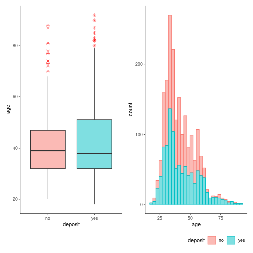

> En el diagrama de caja se diferencian los outliers en color rojo y forma de estrella. No obstante, los mismos pueden no tener mucho sentido ya que la edad es una característica intrínseca y natural que no se considera atípica en sí misma. Cabe destacar que no se encontraron observaciones por debajo de los 18 años.

En el caso de `age` se definieron los siguientes rangos de edades:

-   Adulto Joven: 18 ≤ `age` \< 40
-   Adulto Mediana edad: 40 ≤ `age` \< 59
-   Adulto Mayor: `age` ≥ 59

Se creó la variable `age_category`


```r
df$age_category <- cut(
  df$age,
  breaks = c(18, 40, 59, Inf),
  labels = c("Adulto Joven", "Adulto Mediana edad", "Adulto Mayor"),
  right = FALSE
)
```

Se generó una tabla de frecuencias con las nuevas categorías.


```r
association_table <- data.frame(table(df$deposit, df$age_category))
names(association_table) <- c(target, "age_category", "Frequency")
association_table
```

```
##   deposit        age_category Frequency
## 1      no        Adulto Joven       529
## 2     yes        Adulto Joven       526
## 3      no Adulto Mediana edad       427
## 4     yes Adulto Mediana edad       337
## 5      no        Adulto Mayor        44
## 6     yes        Adulto Mayor       137
```


```r
p <-
  ggplot(association_table,
         aes_string(x = "age_category", y = "Frequency", fill = target)) +
  geom_col(position="dodge") +
  geom_text(
    aes_string(label = "Frequency"),
    size = 3,
    hjust = 0.5,
    vjust = 1,
    position = position_dodge(width = .9)
  ) +
  xlab("Age Category")

p + theme_classic() + theme(legend.position = "bottom", legend.justification = "right")
```

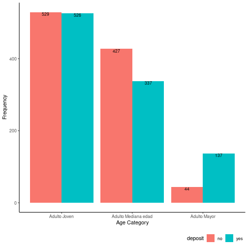

> En los rangos de edades `Adulto Joven` y `Aldulto Mediana edad` los datos se encontraron cercanos a estar balanceados, mientras en el rango `Adulto Mayor` se encontró lo contrario.

### `balance`


```r
p <-
  ggplot(df,
         aes_string(y = numeric_cols[2], x = target, fill = target)) +
  geom_boxplot(alpha = 0.5, outlier.colour="red", outlier.shape=8,
                outlier.size=2)
p1 <-
  ggplot(df,
         aes_string(x = numeric_cols[2], color = target, fill = target)) +
  geom_density(alpha = 0.5)

(p + guides(colour = "none" , fill = "none")) + p1 + plot_layout(ncol = 2) &
  theme_classic() + theme(legend.position = "bottom", legend.justification = "right")
```

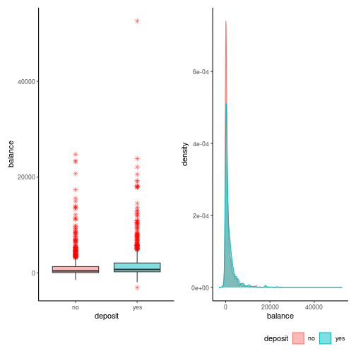

> De la variable en cuestión no se cuenta con información como el tipo de moneda. No obstante, la variable `balance` da cuenta de los fondos que los individuos tienen en su caja de ahorro. Se encontró que los datos tienen una larga cola hacia la derecha con valores atípicos, es decir, individuos con alta liquidez. Por otro lado, una corta cola a la izquierda da cuenta de individuos que cuentan con liquidez negativa.

En el caso de `balance` se definieron los siguientes rangos haciendo uso de los cuartiles.

-   Sobregiro: `balance` \< 0
-   Sustancial: 0 ≤ `balance` \< Q1
-   Considerable: Q1 ≤ `balance` \< Q3
-   Elevado: `balance` ≥ Q3

Se calcularon los cuartiles `Q1` y `Q3` de la variable de `balance`


```r
Q1 <- quantile(df$balance, 0.25)
Q3 <- quantile(df$balance, 0.75)
```

Se creó la variable `balance_category`


```r
df$balance_category <- cut(
  df$balance,
  breaks = c(-Inf, 0, Q1, Q3, Inf),
  labels = c("Sobregiro", "Sustancial", "Considerable", "Elevado"),
  right = FALSE
)
```

Se generó una tabla de frecuencias con las nuevas categorías.


```r
association_table <-
  data.frame(table(df$deposit, df$balance_category))
names(association_table) <-
  c(target, "balance_category", "Frequency")
association_table
```

```
##   deposit balance_category Frequency
## 1      no        Sobregiro        81
## 2     yes        Sobregiro        38
## 3      no       Sustancial       227
## 4     yes       Sustancial       154
## 5      no     Considerable       494
## 6     yes     Considerable       506
## 7      no          Elevado       198
## 8     yes          Elevado       302
```


```r
p <-
  ggplot(association_table,
         aes_string(x = "balance_category", y = "Frequency", fill = target)) +
  geom_col(position = "dodge") +
  geom_text(
    aes_string(label = "Frequency"),
    size = 3,
    hjust = 0.5,
    vjust = 1,
    position = position_dodge(width = .9)
  ) +
  xlab("Balance Category")

p + theme_classic() + theme(legend.position = "bottom", legend.justification = "right")
```

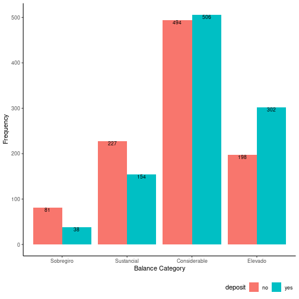

> Los individuos en el rango `Considerable` resultaron ser el principal objetivo de la campaña y los datos se encuentran cercanos a estar balanceados.


```r
print("Total categoría Considerable")
```

```
## [1] "Total categoría Considerable"
```

```r
print(sum(association_table[association_table$balance_category == "Considerable", ]$Frequency))
```

```
## [1] 1000
```

```r
print("Total otras categorías")
```

```
## [1] "Total otras categorías"
```

```r
print(
  sum(
    association_table[association_table$balance_category == "Sobregiro", ]$Frequency,
    association_table[association_table$balance_category == "Sustancial", ]$Frequency,
    association_table[association_table$balance_category == "Elevado", ]$Frequency
  )
)
```

```
## [1] 1000
```

> Cabe destacar, el total de los individuos con baja liquidez (rangos `Sobregiro` y `Sustancial`) e individuos con mayor liquidez (rango `Elevado`) iguala al total de los individuos de liquidez `Considerable`.

### `campaign`


```r
p <-
  ggplot(df,
         aes_string(y = numeric_cols[3], x = target, fill = target)) +
  geom_boxplot(
    alpha = 0.5,
    outlier.colour = "red",
    outlier.shape = 8,
    outlier.size = 2
  )
p1 <-
  ggplot(df,
         aes_string(x = numeric_cols[3], color = target, fill = target)) +
  geom_histogram(alpha = 0.5)

(p + guides(colour = "none" , fill = "none")) + p1 + plot_layout(ncol = 2) &
  theme_classic() + theme(legend.position = "bottom", legend.justification = "right")
```

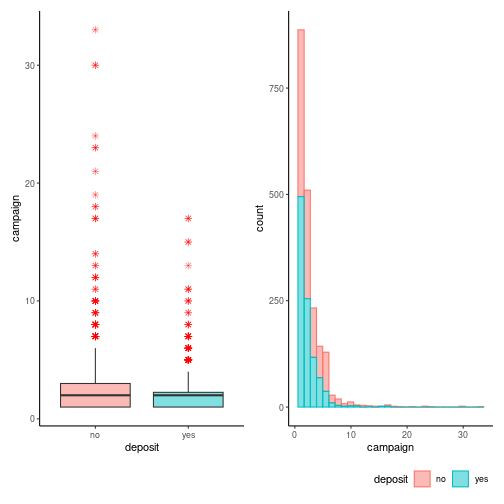

> De acuerdo a la distribución de la variable en cuestión se intuyó que existe un grupo mayoritario que toma la decisión en menos de las 10 llamadas y un pequeño grupo que presenta un proceso particularmente largo.

Con el propósito de mejorar el análisis de la variable se propone analizarla haciendo uso de otro gráfico.


```r
p <-
  ggplot(df,
         aes_string(x = numeric_cols[3], y = target, fill = target)) +
  geom_jitter(width = 0.1, aes_string(color = target))

p + scale_x_discrete(name ="Campaign", limits=seq(0, 35, 5)) & theme_classic() + theme(legend.position = "bottom", legend.justification = "right") 
```

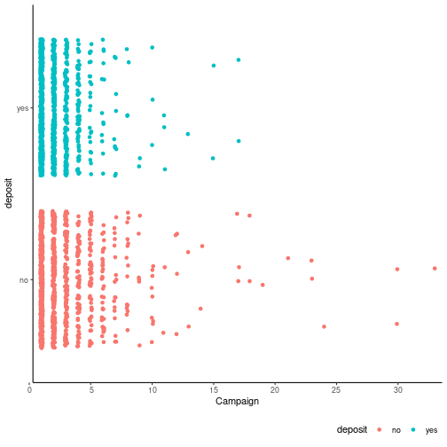

> Lorem

Dada la larga cola hacia la derecha (presencia de outliers) se definieron los siguientes rangos haciendo uso de la mediana:

-   Decidido: 0 ≤ `campaign` \< Q2
-   Indeciso: Q2 ≤ `campaign` \< Q3
-   Muy indeciso: `campaign` ≥ Q3

Se calcularon los cuartiles `Q2` y `Q3` de la variable de `campaign`


```r
Q2 <- quantile(df$campaign, 0.50)
Q3 <- quantile(df$campaign, 0.75)
```

Se creó la variable `campaign_category`


```r
df$campaign_category <- cut(
  df$campaign,
  breaks = c(0, Q2, Q3, Inf),
  labels = c("Decidido", "Indeciso", "Muy indeciso"),
  right = FALSE
)
```

Se generó una tabla de frecuencias con las nuevas categorías.


```r
association_table <- data.frame(table(df$deposit, df$campaign_category))
names(association_table) <- c(target, "campaign_category", "Frequency")
association_table
```

```
##   deposit campaign_category Frequency
## 1      no          Decidido       392
## 2     yes          Decidido       495
## 3      no          Indeciso       255
## 4     yes          Indeciso       255
## 5      no      Muy indeciso       353
## 6     yes      Muy indeciso       250
```


```r
p <-
  ggplot(association_table,
         aes_string(x = "campaign_category", y = "Frequency", fill = target)) +
  geom_col(position="dodge") +
  geom_text(
    aes_string(label = "Frequency"),
    size = 3,
    hjust = 0.5,
    vjust = 1,
    position = position_dodge(width = .9)
  ) +
  xlab("Campaign Category")

p + theme_classic() + theme(legend.position = "bottom", legend.justification = "right")
```

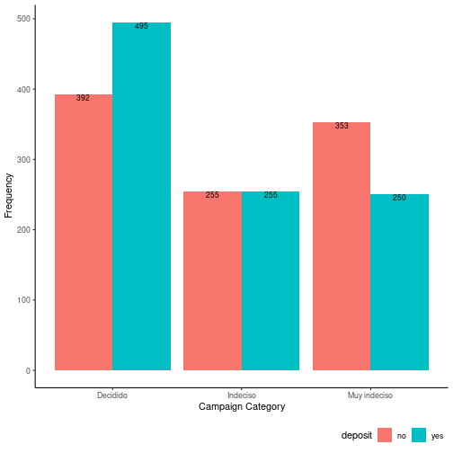

> Lorem

### `duration`


```r
p <-
  ggplot(df,
         aes_string(y = numeric_cols[4], x = target, fill = target)) +
  geom_boxplot(
    alpha = 0.5,
    outlier.colour = "red",
    outlier.shape = 8,
    outlier.size = 2
  )

p1 <-
  ggplot(df,
         aes_string(x = numeric_cols[4], color = target, fill = target)) +
  geom_density(alpha = 0.5)

(p + guides(colour = "none" , fill = "none")) + p1 + plot_layout(ncol = 2) &
  theme_classic() + theme(legend.position = "bottom", legend.justification = "right")
```

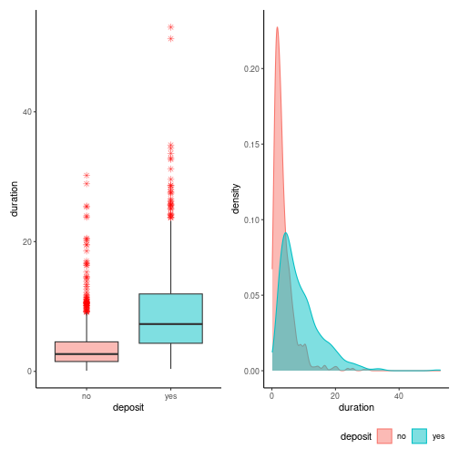

> Lorem

En el caso de `duration` se definieron los siguientes rangos:

-   : `duration` = 0
-   : 0 \< `duration` ≤ Q2
-   : `duration` \> Q2

Se calculó el cuartil `Q2` de la variable `duration`


```r
Q2 <- quantile(df$duration, 0.50)
```

Se creó la variable `duration_category`


```r
df$duration_category <- cut(
  df$duration,
  breaks = c(0, Q2, Inf),
  labels = c("Corta", "Extensa"),
  right = FALSE
)
```

Se generó una tabla de frecuencias con las nuevas categorías.


```r
association_table <- data.frame(table(df$deposit, df$duration_category))
names(association_table) <- c(target, "duration_category", "Frequency")
association_table
```

```
##   deposit duration_category Frequency
## 1      no             Corta       735
## 2     yes             Corta       264
## 3      no           Extensa       265
## 4     yes           Extensa       736
```


```r
p <-
  ggplot(association_table,
         aes_string(x = "duration_category", y = "Frequency", fill = target)) +
  geom_col(position="dodge") +
  geom_text(
    aes_string(label = "Frequency"),
    size = 3,
    hjust = 0.5,
    vjust = 1,
    position = position_dodge(width = .9)
  ) +
  xlab("Duration Category")

p + theme_classic() + theme(legend.position = "bottom", legend.justification = "right")
```

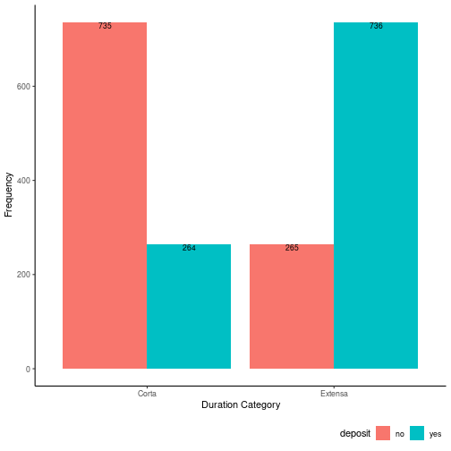

> Lorem

### `pdays`


```r
p <-
  ggplot(df,
         aes_string(y = numeric_cols[5], x = target, fill = target)) +
  geom_boxplot(
    alpha = 0.5,
    outlier.colour = "red",
    outlier.shape = 8,
    outlier.size = 2
  )

p1 <-
  ggplot(df,
         aes_string(x = numeric_cols[5], color = target, fill = target)) +
  geom_histogram(alpha = 0.5)

(p + guides(colour = "none" , fill = "none")) + p1 + plot_layout(ncol = 2) &
  theme_classic() + theme(legend.position = "bottom", legend.justification = "right")
```

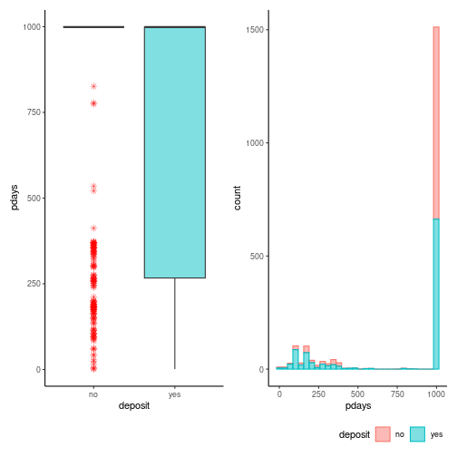

> Como consta en la sección \@sec-attribute_info

In section [Attribute info](#attribute_information)

En el caso de `pdays` se definieron los siguientes rangos:

-   Corriente: `pdays` \< 999
-   Especial: `pdays` ≥ 999

> Únicamente se definió este par de rangos ya que `Q1`, `Q2`, `Q3` de la variable en cuestión corresponden al valor de `999` (ver análisis descriptivo).

Se creó la variable `pdays_category`


```r
df$pdays_category <- cut(
  df$pdays,
  breaks = c(-Inf,999, Inf),
  labels = c("Corriente", "Especial"),
  right = FALSE
)
```

Se generó una tabla de frecuencias con las nuevas categorías.


```r
association_table <- data.frame(table(df$deposit, df$pdays_category))
names(association_table) <- c(target, "pdays_category", "Frequency")
association_table
```

```
##   deposit pdays_category Frequency
## 1      no      Corriente       151
## 2     yes      Corriente       337
## 3      no       Especial       849
## 4     yes       Especial       663
```


```r
p <-
  ggplot(association_table,
         aes_string(x = "pdays_category", y = "Frequency", fill = target)) +
  geom_col(position="dodge") +
  geom_text(
    aes_string(label = "Frequency"),
    size = 3,
    hjust = 0.5,
    vjust = 1,
    position = position_dodge(width = .9)
  ) +
  xlab("pdays Category")

p + theme_classic() + theme(legend.position = "bottom", legend.justification = "right")
```

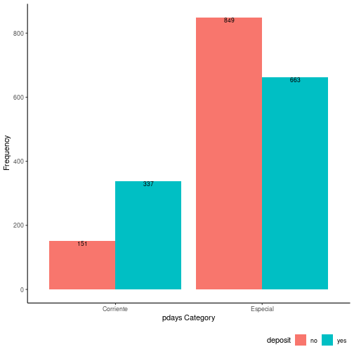

> Lorem

Con el propósito de mejorar el análisis de la variable se propone analizarla haciendo uso de otro gráfico.


```r
p <-
  ggplot(df[df$pdays<999,],
         aes_string(y = numeric_cols[5], x = target, fill = target)) +
  geom_boxplot(
    alpha = 0.5,
    outlier.colour = "red",
    outlier.shape = 8,
    outlier.size = 2
  )

p1 <-
  ggplot(df[df$pdays<999,],
         aes_string(x = numeric_cols[5], color = target, fill = target)) +
  geom_histogram(alpha = 0.5)

(p + guides(colour = "none" , fill = "none")) + p1 + plot_layout(ncol = 2) &
  theme_classic() + theme(legend.position = "bottom", legend.justification = "right")
```

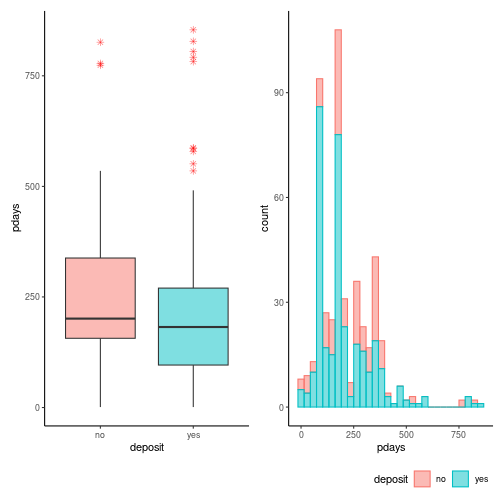

> Lorem

### `previous`


```r
p <-
  ggplot(df,
         aes_string(y = numeric_cols[6], x = target, fill = target)) +
  geom_boxplot(
    alpha = 0.5,
    outlier.colour = "red",
    outlier.shape = 8,
    outlier.size = 2
  )

p1 <-
  ggplot(df,
         aes_string(x = numeric_cols[6], color = target, fill = target)) +
  geom_histogram(alpha = 0.5)

(p + guides(colour = "none" , fill = "none")) + p1 + plot_layout(ncol = 2) &
  theme_classic() + theme(legend.position = "bottom", legend.justification = "right")
```

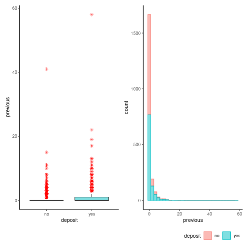

> Lorem

En el caso de `pdays` se definieron los siguientes rangos:

-   Negativo: `pdays` ≤ 0
-   Positivo: `pdays` \> 0

> Únicamente se definió este par de rangos ya que `Q1`, `Q2`, `Q3` de la variable en cuestión corresponden al valor de `0` (ver análisis descriptivo).

Se creó la variable `previous_category`


```r
df$previous_category <- cut(
  df$previous,
  breaks = c(-Inf, 0, Inf),
  labels = c("Negativo", "Positivo"),
  right = TRUE
)
```

Se generó una tabla de frecuencias con las nuevas categorías.


```r
association_table <- data.frame(table(df$deposit, df$previous_category))
names(association_table) <- c(target, "previous_category", "Frequency")
association_table
```

```
##   deposit previous_category Frequency
## 1      no          Negativo       849
## 2     yes          Negativo       663
## 3      no          Positivo       151
## 4     yes          Positivo       337
```


```r
p <-
  ggplot(association_table,
         aes_string(x = "previous_category", y = "Frequency", fill = target)) +
  geom_col(position="dodge") +
  geom_text(
    aes_string(label = "Frequency"),
    size = 3,
    hjust = 0.5,
    vjust = 1,
    position = position_dodge(width = .9)
  ) +
  xlab("previous Category")

p + theme_classic() + theme(legend.position = "bottom", legend.justification = "right")
```

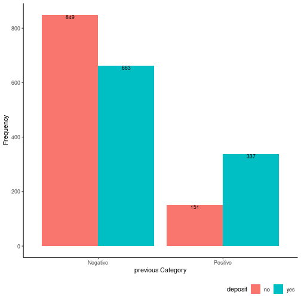

> Lorem

Con el propósito de mejorar el análisis de la variable se propone analizarla haciendo uso de otro gráfico.


```r
p <-
  ggplot(df[df$previous>0,],
         aes_string(y = numeric_cols[6], x = target, fill = target)) +
  geom_boxplot(
    alpha = 0.5,
    outlier.colour = "red",
    outlier.shape = 8,
    outlier.size = 2
  )

p1 <-
  ggplot(df[df$previous>0,],
         aes_string(x = numeric_cols[6], color = target, fill = target)) +
  geom_histogram(alpha = 0.5)

(p + guides(colour = "none" , fill = "none")) + p1 + plot_layout(ncol = 2) &
  theme_classic() + theme(legend.position = "bottom", legend.justification = "right")
```

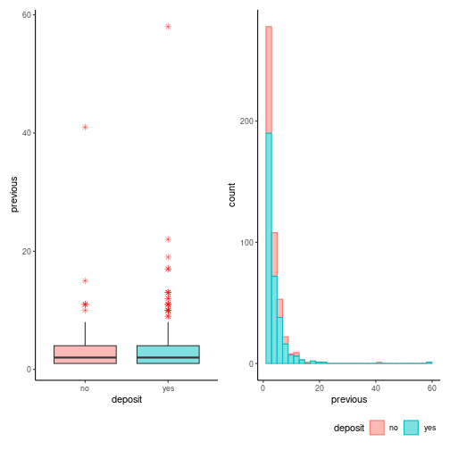

------------------------------------------------------------------------

## 4. Tabla de frecuencias \~ `marital`

Presente una tabla de frecuencias y porcentaje para la variable `marital` (estado civil) según el nivel de la variable `deposit`.


```r
pair <- c(target, "marital")
```


```r
table_freq <- table(subset(df, select = pair))
table_per <- table_freq / sum(table_freq)
```


```r
table_freq <- data.frame(table_freq) %>% rename("Frequency"="Freq")
table_freq
```

```
##   deposit  marital Frequency
## 1      no divorced       125
## 2     yes divorced       133
## 3      no  married       617
## 4     yes  married       510
## 5      no   single       258
## 6     yes   single       357
```


```r
table_per <- data.frame(table_per)%>% rename("Percentage"="Freq")
table_per
```

```
##   deposit  marital Percentage
## 1      no divorced     0.0625
## 2     yes divorced     0.0665
## 3      no  married     0.3085
## 4     yes  married     0.2550
## 5      no   single     0.1290
## 6     yes   single     0.1785
```

------------------------------------------------------------------------

## 5. Gráfico de frecuencias \~ `marital`

Realice un gráfico para representar la tabla construida en el punto 4.


```r
p <-
  ggplot(table_freq,
         aes_string(fill = target, y = "Frequency", x = "marital")) +
  geom_col(position = "dodge") +
  geom_text(
    aes_string(label = "Frequency"),
    size = 3,
    hjust = 0.5,
    vjust = 3,
    position = position_dodge(width = .9)
  )

p + theme_classic() + theme(
  legend.position = "bottom",
  legend.justification = "right",
  plot.title = element_text(hjust = 0.5)
) + labs(title = "Distribución de estados civiles")
```

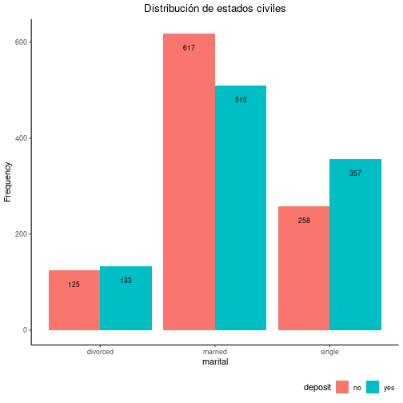

> Existe una ligera diferencia en la proporción de individuos `married` que no aceptaron el depósito. Ahora bien, dicha diferencia no supera el 20%. La categoría `married` tiene una mayor representación en los datos que las demás categorías.

A continuación se muestra la tabla de porcentaje.


```r
p <-
  ggplot(table_per,
         aes_string(fill = target, y = "Percentage", x = "marital")) +
  geom_col(position = "dodge") + ylim(0, 1) +
  geom_text(
    aes_string(label = "Percentage"),
    size = 3,
    hjust = 0.5,
    vjust = 1.5,
    position = position_dodge(width = .9)
  )

p + theme_classic() + theme(
  legend.position = "bottom",
  legend.justification = "right",
  plot.title = element_text(hjust = 0.5)
) + labs(title = "Distribución normalizada de estados civiles")
```

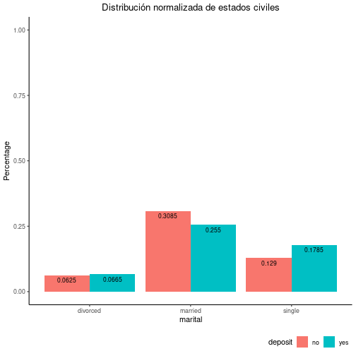

------------------------------------------------------------------------

## 6. Asociación entre `age` y `duration`

Elija dos variables `numéricas`, establezca rangos que representen distintos niveles de cada una y defina nuevas variables categóricas. Aplique un test adecuado para entender si existe asociación entre ambas. Utilice un nivel de significación del 5%.

Se eligieron las variables `age` y `duration`.


```r
contingency_table <- table(df$age_category, df$duration_category)
contingency_table
```

```
##                      
##                       Corta Extensa
##   Adulto Joven          543     512
##   Adulto Mediana edad   391     373
##   Adulto Mayor           65     116
```


```r
res_test <- chisq.test(contingency_table)
res_test
```

```
## 
## 	Pearson's Chi-squared test
## 
## data:  contingency_table
## X-squared = 16, df = 2, p-value = 4e-04
```


```r
res_test$p.value < alpha
```

```
## [1] TRUE
```

------------------------------------------------------------------------

## 7. Asociación entre `education` y `housing`

Seleccione la variable `education` y elija otra variable categórica. Aplique un test adecuado para entender si existe asociación entre ambas. Utilice un nivel de significación del 5%.


```r
pair <- c("education", "housing")
```


------------------------------------------------------------------------

## 8. Diferencia de medias `age` según `deposit`

Seleccione otra variable continua y estime la diferencia de medias según el valor de la variable `deposit` con un nivel de confianza del 95%. Interprete el resultado obtenido.


```r
qqPlot(df$age)
```

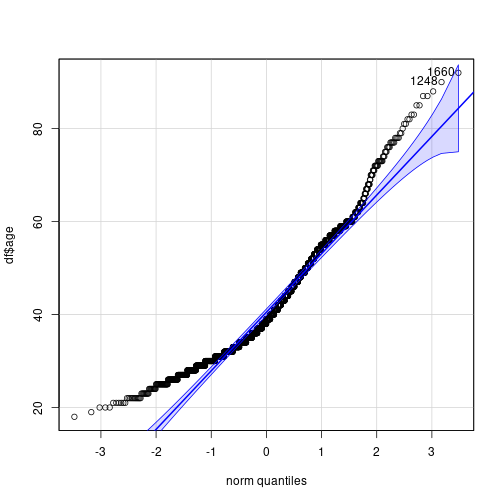

```
## [1] 1660 1248
```


```r
params <- as.list(MASS::fitdistr(df$age, "t")$estimate)

ggplot(df, aes(sample = age)) +
  geom_qq(distribution = qt, dparams = params["df"]) +
  geom_qq_line(distribution = qt, dparams = params["df"])
```

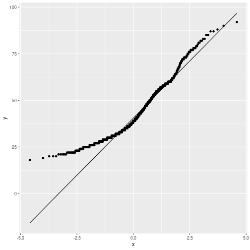


```r
result <- chisq.test(table(df$age))

# Imprimir el valor p
print(paste("Valor p:", result$p.value))
```

```
## [1] "Valor p: 0"
```

```r
print(paste("Recahzar H0:", result$p.value < alpha))
```

```
## [1] "Recahzar H0: TRUE"
```


```r
group_yes <- df$age[df$deposit == "yes"]
group_no <- df$age[df$deposit == "no"]
```


```r
t_test <- t.test(group_yes, group_no)
```


```r
t_test
```

```
## 
## 	Welch Two Sample t-test
## 
## data:  group_yes and group_no
## t = 3.1, df = 1882, p-value = 0.002
## alternative hypothesis: true difference in means is not equal to 0
## 95 percent confidence interval:
##  0.6072 2.7248
## sample estimates:
## mean of x mean of y 
##     42.22     40.56
```


```r
print(paste("Media 'deposit: yes':", mean(group_yes)))
```

```
## [1] "Media 'deposit: yes': 42.223"
```

```r
print(paste("Media 'deposit: no':", mean(group_no)))
```

```
## [1] "Media 'deposit: no': 40.557"
```

```r
print(paste("Estadístico t:", t_test$statistic))
```

```
## [1] "Estadístico t: 3.08584402661475"
```

------------------------------------------------------------------------

## 9. Diferencia de medias

Según el resultado obtenido en el `punto 8.`- realice un test de hipótesis apropiado para determinar la diferencia de medias de la variable en estudio. Trabaje con una significación del 5%. Presente el planteo de hipótesis adecuado, la resolución y la decisión a tomar.


```r
print(paste("Valor p:", t_test$p.value))
```

```
## [1] "Valor p: 0.00205930608870324"
```

```r
print(paste("Rechazar H0:", t_test$p.value < alpha))
```

```
## [1] "Rechazar H0: TRUE"
```

------------------------------------------------------------------------

## 10. Diferencia de medias `balance` según `deposit`

Seleccione una muestra de `30` elementos estratificada según la variable `deposit`. ¿Se puede afirmar que hay diferencias significativas en el `balance` de los que realizaron el `depósito` respecto a aquellos que no lo hicieron? Elija un test de hipótesis adecuado. Trabaje con una significación del 5%.


```r
set.seed(108)
df_sample <- stratified(df, c("deposit"), 15)
```


```r
qqnorm(df_sample$balance)
qqline(df_sample$balance)
```

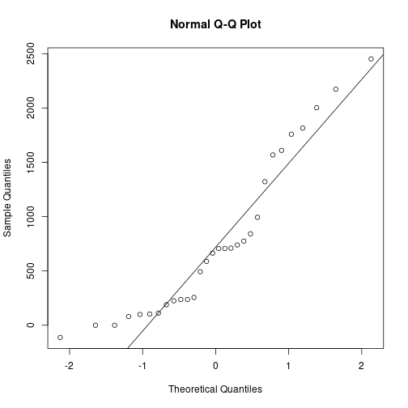

```r
#qqplot(y=df$age, conf.level = 1 - alpha)
#qqPlot(balance~deposit, data=df)
```


```r
result <- shapiro.test(df_sample$balance)

# Imprimir el valor p
print(paste("Valor p:", result$p.value))
```

```
## [1] "Valor p: 0.00563018776782263"
```

## 11.

Decida si existen diferencias significativas en la `duración` respecto los niveles de `educación` (`secondary`, `tertiary`, `primary`, `unknown`). Justifique. Utilice un test adecuado. Realice las pruebas necesarias para comprobar los supuestos. Trabaje con una significación del 5%.


```r
pair <- c("education", "duration")
```


```r
# Realizar un ANOVA
modelo <- aov(duration ~ education, data = df)

# Obtener los resultados del ANOVA
resultado_anova <- summary(modelo)

# Imprimir los resultados del ANOVA
print(resultado_anova)
```

```
##               Df Sum Sq Mean Sq F value Pr(>F)
## education      3     60    19.9    0.59   0.62
## Residuals   1996  67760    33.9
```


```r
# Realizar pruebas de comparación de medias (t-tests)
#resultado_t_test <- t.test(duration ~ education, data = df)

# Imprimir los resultados de las pruebas t
#print(resultado_t_test)
```

## 12.

Elija dos variables cuantitativas, determine la variable explicativa y la variable explicada. Encuentre la ecuación de la recta de regresión lineal que explique la relación entre las variables elegidas. Escriba conclusiones acerca de la significatividad del modelo aplicado. Puede acompañar el modelo de un gráfico adecuado.


13. Presente un informe final con un mínimo de 500 y un máximo de 800 palabras del análisis de la base de datos, describiendo la base de datos, indicando la presencia de valores atípicos y las conclusiones a las que se abordó luego del análisis.
